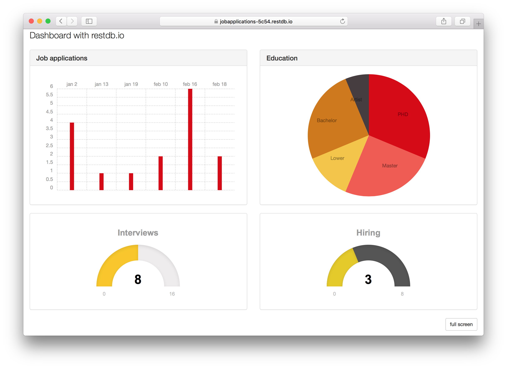

# Dashboard with RestDB

Example code from blog post on how to create Dashboards in RestDB.
The Dashboard shows statistics for a job application database.

Read blogpost: https://restdb.io/blog/how-to-create-dashboards

View live demo here: 
https://jobapplications-5c54.restdb.io/views/public/dashboard
